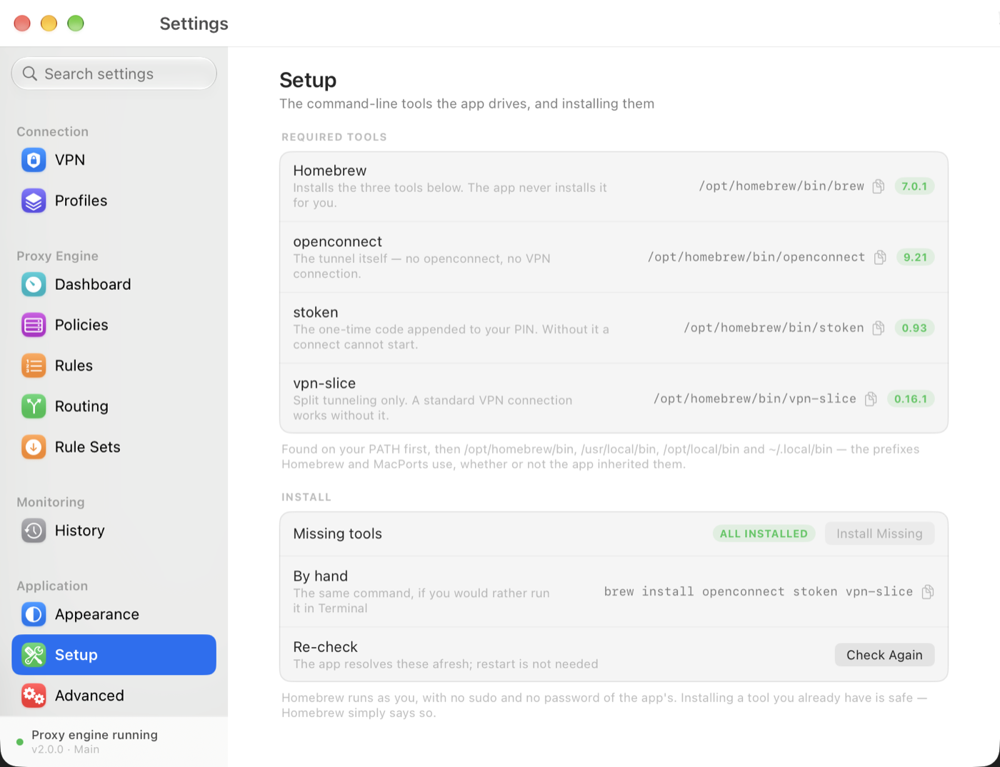

# TurtleDiver

TurtleDiver is a macOS menu bar app that connects to an `openconnect` VPN —
taking the one-time code from `stoken` and splitting routes with `vpn-slice` —
and routes traffic through a local, rule-based proxy engine in the style of
[Surge](https://nssurge.com). It is the macOS counterpart to
[hellsturtle](https://github.com/idrakimuhamad/hellsturtle).

Everything lives on the machine: credentials in the Keychain, profiles and rule
caches in Application Support, logs under `~/Library/Logs`. There is no account,
no telemetry, and no cloud sync.

- [Features](#features)
- [Requirements](#requirements)
- [Installing](#installing)
- [Getting started](#getting-started)
- [Using TurtleDiver](#using-turtlediver)
- [How it is built](#how-it-is-built)
- [Security and privacy](#security-and-privacy)
- [Upgrading from an earlier version](#upgrading-from-an-earlier-version)
- [Troubleshooting](#troubleshooting)
- [Development](#development)

## Features

**VPN connection.** Credentials, token and split-tunnel targets are configured
once in Settings; **Connect VPN** then generates the one-time code, launches
`openconnect` and, if the tunnel is on, applies `vpn-slice`. The session's
duration is shown in the window, and every attempt is recorded in **History**
with its own log. A connection that fails says what failed — a tunnel that
could not be ended reports `Failed - Still Connected` rather than claiming
success.

**Proxy engine.** A local HTTP listener on `127.0.0.1:6152` and a SOCKS5
listener on `127.0.0.1:6153`, driven by Surge-compatible profiles: rule
matching (`DOMAIN`, `DOMAIN-SUFFIX`, `IP-CIDR`, `PROCESS-NAME`, `RULE-SET`,
`FINAL`, …) and policy groups (`select`, `url-test`, `fallback`,
`load-balance`). The engine is independent of the VPN — it runs with or without
a tunnel — and outbound connections go through a bounded pool, so one
unreachable upstream costs a slot and its own timeout rather than the engine.

**Rules and routing.** The **Routing** pane is the everyday screen: assign a
policy per domain, domain-suffix or IP-CIDR, in a list you can quick-add, edit
inline and reorder. An **Import PAC** wizard converts an existing
`FindProxyForURL` script into rules and proxy policies.

**Remote rule sets.** Subscribe to a rule list over HTTPS and reference it from
a rule (`RULE-SET,Ads,REJECT`): the list is downloaded once, cached at mode
`0600`, spliced in *at the reference's position*, and shown with its source URL,
rule count, age and skipped-line count.

**Live dashboard.** Request table (host, rule, policy, traffic, duration),
latency badges per policy with **Test All**, traffic counters, and the live
openconnect log, colour-coded by line. Select-group policies can be overridden
from the table, and clicking a row opens the full **request details**.

**System proxy.** One click applies HTTP/HTTPS/SOCKS to every network service,
with a snapshot taken first so the previous configuration can be restored. The
*intent* is remembered, so the proxy is re-applied on the next launch instead of
being silently lost, and a crash that leaves macOS pointed at a dead engine is
repaired on the next start.

**Updates.** TurtleDiver asks GitHub once at launch whether a newer release
exists — opt-out, plus **Check Now** — and offers it in Settings ▸ Updates, in
the menu bar and under the main window. Nothing downloads until you click, and
nothing is installed unless five gates pass. See
[Updates](#updates) and [`docs/UPDATES.md`](docs/UPDATES.md).

**Setup.** The tools the app drives are resolved on `$PATH` first and listed
with the path and version each one reports; missing ones can be installed with
one click (`brew install`, run as you, no password).

## Requirements

- **macOS 14 or later.**
- **Homebrew and three command-line tools**, which the app drives rather than
  bundles:

```bash
brew install openconnect
brew install stoken
brew install vpn-slice
```

They are looked up on `$PATH` first and then in `/opt/homebrew/bin`,
`/usr/local/bin`, `/opt/local/bin`, `~/.local/bin`, `/usr/bin` and `/bin` — the
prefixes Homebrew and MacPorts use, whether or not the app inherited them. The
**Setup** pane (⌘, → Application → Setup, or the menu bar's *Check
Requirements…*) shows each tool with the path it resolved and the version it
reports, and installs the missing ones with one click. It is advisory: nothing
is disabled when a tool is absent, and a **Connect** that cannot start says
which tool is missing and points at that pane. Homebrew itself is never
installed for you.

Bundling the tools into the app is not viable: they and their 19 Homebrew
dependencies come to 212 MB, and they are LGPL-2.1 / GPL-3.0, so redistributing
our own copies would add relinking and source-offer obligations on top of the
re-signing work.



## Installing

Download `TurtleDiver-<version>.dmg` from the
[releases page](https://github.com/idrakimuhamad/TurtleDiver/releases), open it,
and drag **TurtleDiver** onto the **Applications** shortcut. A `.pkg` is also
built for managed installs.

**Release builds are signed but not notarized**, so a downloaded copy is
quarantined by macOS and the first launch refuses to open it. Either right-click
the app ▸ **Open**, or if macOS offers no override that way allow it in **System
Settings ▸ Privacy & Security**; the blunt alternative is:

```bash
xattr -dr com.apple.quarantine /Applications/TurtleDiver.app
```

A copy built on your own Mac — or installed from `./build.sh --install` — has no
quarantine attribute and launches directly. See
[`docs/DISTRIBUTION.md`](docs/DISTRIBUTION.md) for what it would take to make
downloads open without that prompt (a Developer ID certificate and
notarization).

## Getting started

### Configure the connection

1. Launch the app and open **TurtleDiver ▸ Settings** (⌘,).
2. Fill in **Connection ▸ VPN**:
   - **VPN Host** — the VPN server's hostname
   - **VPN ID** — your username
   - **VPN Password**
   - **Passcode** — the PIN your token expects
   - **Administrator password (sudo)** — only needed where Touch ID for `sudo`
     is not enabled; the app prefers `sudo -n` and macOS's own dialog when it can
   - **Slice URLs** — the hosts and addresses `vpn-slice` should route through
     the tunnel, one per line
3. The VPN pane is the only pane with an explicit **Save / Revert** bar (⌘S);
   everything else applies as you change it. Credentials go to the Keychain.

### Connect and disconnect

Choose whether to tunnel (**With tunneling** uses `vpn-slice` to route only the
configured targets; **Without tunneling** routes everything), then press
**Connect VPN**. macOS may ask for Touch ID or your administrator password, and
the app waits for that dialog — see
[Asking for administrator rights](#asking-for-administrator-rights). **Disconnect**
ends the session and restores the network.

## Using TurtleDiver

### The main window

The window opens **compact**: status, session timer, Connect/Disconnect, and the
four switches (Tunneling, Proxy Engine, Use as System Proxy, Debug Output).
**Show Dashboard ⌄** expands the same window in place into the dashboard — the
switch cards, a **Proxy Engine** card (listening addresses), a **Policy Health**
card (latency per policy, **Test All**), a **Traffic** card, the live **Recent
Requests** table and the **Live Log** — and **Hide Dashboard** collapses it
back. There is one window in two states, so the everyday loop (VPN, engine,
system proxy) never requires Settings.

The compact rows are a list, not a form: labels on the left, the switch on a
shared right edge, a hairline between rows. The live log is colour-coded by line
(`[SEND]` purple, `[HANDLER]` blue, warnings amber, errors red) rather than by
stream, because openconnect writes ordinary progress to stderr.

Two behaviours worth knowing:

- **Auto-expand.** The dashboard opens itself when the tunnel reaches
  `Connected`, or when *you* switch the proxy engine on — never on the launch
  auto-start of the engine, so a saved preference cannot override the window
  state you left behind. It folds back when the tunnel drops, but only if it
  opened it: once you toggle it yourself, that choice sticks and is remembered
  between launches.
- **Resizing.** Only the compact ↔ expanded change (and launch) resizes the
  window; it keeps its top edge and horizontal centre, and is clamped to the
  visible screen. Manual resizes are never overridden by VPN status changes.

The menu bar item carries the same actions, plus *Check Requirements…* and the
update offer when there is one.

### Settings

**TurtleDiver ▸ Settings** (⌘,) is a sidebar-and-detail window, like the rest of
macOS: pick a pane on the left, the pane itself never pushes another screen, and
the window reopens on the pane you were last in. The sidebar is searchable —
typing `log`, `stoken` or `listener` filters it by title, subtitle and keywords.

| Group | Panes |
| --- | --- |
| Connection | **VPN** (credentials, software token, split tunneling), **Profiles** |
| Proxy Engine | **Dashboard**, **Policies**, **Rules**, **Routing**, **Rule Sets** |
| Monitoring | **History** (past connection attempts, with each attempt's log) |
| Application | **Setup**, **Appearance**, **Advanced** |

- **VPN** is the only pane with an explicit **Save / Revert** (⌘S) bar, pinned
  to the bottom. Everything else applies immediately, but credentials go to the
  Keychain, and writing a half-typed password on every keystroke would be noisy
  and would lose the previous value.
- **Advanced** reports the engine's status and listening addresses, the log
  files, the profiles folder, whether each credential is in the Keychain
  (presence only, never the value), and hosts the destructive **Reset All
  Settings** — profiles on disk are left alone.

Settings uses the same visual language as the dashboard: 10 pt cards,
hairline-separated rows, one shared right edge for controls, monospaced paths
and ports, and a status pill per row.

### Routing

**Settings ▸ Routing** is the daily-driver screen: `DOMAIN-SUFFIX example.com →
Proxy A`, `IP-CIDR 1.2.3.0/24 → DIRECT`, and so on. Rules are matched in order,
first match wins, with the active profile's `FINAL` as catch-all. The toolbar's
*Import PAC* pastes or loads a `.pac` file, previews the proxies, groups, rules
and diagnostics it would create, and applies them to the active profile.

### Rule Sets

**Settings ▸ Rule Sets** subscribes to a remote rule list — the Surge-style
`RULE-SET` feature, without the feed-reader baggage:

```ini
[Rule Set]
Ads = https://example.com/ads.conf, interval=86400

[Rule]
RULE-SET,Ads,REJECT
```

The pane adds, edits and removes those declarations, and owns the only button in
the app that fetches a rule list. A downloaded list is spliced into the rule
list *at the position of the reference*, so a `DOMAIN` rule written above
`RULE-SET,Ads,…` still wins, and the policy comes from the reference, never from
the list. Each row shows its source URL, rule count, age, and how many lines
were skipped as unparseable.

A remote list decides where traffic goes, so it is treated as untrusted input:

- **HTTPS only** — an `http://` or `file://` URL is refused and no request
  leaves the machine.
- **Bounded** — an 8 MB cap, UTF-8 only, at most 100 000 rules; `FINAL` and
  nested `RULE-SET` lines are skipped, not honoured.
- **Never executed** — the body is parsed as text, exactly like a local profile.
- **Refresh is opt-in** — only sets that declare an `interval` are fetched on
  their own, and only at launch. Every other download is your idea.
- **A failed refresh keeps the last good copy**, and a reference with no cached
  list stays **inert** rather than silently falling back to its policy.
- Cache files live in `~/Library/Application Support/TurtleDiver/RuleSets/` at
  mode `0600`, named after the URL hash, so changing the URL invalidates them.

### Request details

Click any row in the dashboard's request table (Settings ▸ **Dashboard**) to
open a sheet with what was sent and what came back:

- **General** — the row itself: host, port, rule, policy, size, duration, the
  address the relay actually connected to, and any capture note.
- **Request** — the request line and the request headers. For `http://` this is
  the whole head; for `CONNECT` it is the CONNECT line plus its own headers.
- **Response** — status line and response headers, captured on the plain-HTTP
  leg. A tunnel's response stays encrypted, and the sheet says so rather than
  showing an empty box.
- **TLS handshake** — the server name (SNI), version and ALPN protocol read from
  the client's ClientHello. The ClientHello is cleartext by design, so this is
  where a `CONNECT 1.2.3.4:443` (or a SOCKS5 row, which only ever had an
  address) learns the hostname it was really for.

Nothing is decrypted and no certificate is inspected: TLS 1.3 encrypts the
certificate message, so there is no chain to show. Each section has a **Copy**
button, and **Copy All** puts the whole sheet on the clipboard.

Sensitive header values — `Authorization`, `Cookie`, `Set-Cookie`,
`Proxy-Authorization`, `X-Api-Key`, and anything whose name looks like a token,
secret or password — are replaced with `•••• (N chars)` **at capture time**, so
the value is never held in memory at all. Settings ▸ Dashboard ▸ **Show
sensitive header values** opts out of that redaction for new captures (useful
when a session cookie is what you are debugging). Capture itself can be turned
off with **Record request details**.

Details are bounded — at most 32 headers per message, values truncated at 512
bytes, and only the newest 200 rows keep a detail — and they live in memory
only. They never reach `vpn.log`, which a source-scan test enforces.

### Updates

**Settings ▸ Updates** answers two questions, and they are deliberately separate.

*Is there a newer release?* — asked once at launch (opt-out, in this pane) and
on **Check Now**. It is one unauthenticated GET to
`https://api.github.com/repos/idrakimuhamad/TurtleDiver/releases/latest`, and it
sends nothing about you or this machine. The offer shows the version, size,
release date and a link to the release notes.

*Get it* — only after a click, and only ever from that repository. What it
fetches has to pass five gates before it is allowed near an application folder:

1. **Provenance** — both assets came over `https`, and are named exactly as the
   version being installed names them.
2. **Size** — the file is not the empty file a failed request leaves behind, is
   inside the 256 MB limit, and is the byte count the release published.
3. **Digest** — its SHA-256 equals the digest in the published `.sha256` asset
   **and** GitHub's own digest for the same asset.
4. **Signature** — `codesign --verify --deep --strict` passes and the team
   identifier is the one this project is signed with.
5. **Identity** — the bundle identifier is `com.xvii.kurakura.vpn`, the version
   inside the image is the version the tag claimed, and it is newer than what is
   running.

It replaces itself where the bundle is writable and points the Finder at the
verified image where it is not. It never asks for a password: a self-updater
that elevates to replace itself can be talked into replacing anything.

Installing means quitting, and quitting ends the tunnel, so a connected app
refuses to install until you disconnect: the button becomes **Disconnect and
Update…**, and the second click is the one that acts. The app is not restarted
for you — the update is applied and you press **Restart Now**.

[`docs/UPDATES.md`](docs/UPDATES.md) is the long version: the feed contract,
every gate, where the files go, and the bounded `/bin/sh` waiter that reopens
the app afterwards.

### The proxy engine

Settings ▸ **Dashboard** holds the engine toggle. When enabled, the app listens
on `127.0.0.1:6152` (HTTP) and `127.0.0.1:6153` (SOCKS5) and routes every
request through the active profile's rules. The engine is independent of the
VPN: it can run with or without a tunnel, and when split tunneling is active,
`vpn-slice` targets are added as `DIRECT` rules so corporate traffic always
flows through the tunnel.

- [`docs/PROXY_ENGINE.md`](docs/PROXY_ENGINE.md) — listeners, routing, request log
- [`docs/PROFILES.md`](docs/PROFILES.md) — profile syntax (`[General]`,
  `[Proxy]`, `[Proxy Group]`, `[Rule]`)
- [`docs/SYSTEM_PROXY.md`](docs/SYSTEM_PROXY.md) — system proxy lifecycle and the
  VPN tie-in
- [`docs/ELEVATION.md`](docs/ELEVATION.md) — how the app asks for privilege, and
  every deadline it waits on
- [`docs/SETTINGS_LAYOUT.md`](docs/SETTINGS_LAYOUT.md) — why the sidebar is
  172 pt wide, and the titlebar height contract

## How it is built

- **AppDelegate** — application lifecycle, status-bar menu, window sizing
- **MainView** — the main window in its compact and expanded states
- **VPNManager** — VPN connection logic; launches `openconnect` and owns the
  tunnel's lifecycle
- **EngineController** — the proxy engine's lifecycle, the active profile and
  the system-proxy intent
- **Profile / ProfileManager** — Surge-compatible `.conf` profiles under
  `~/Library/Application Support/TurtleDiver/Profiles`
- **Engine** — HTTP and SOCKS5 listeners, the relay, rule matching, and the
  observe-only capture behind the request-detail sheet (`RequestDetail`,
  `TLSClientHello`, `RelayStreamObserver`)
- **Rules** — rule matching, PAC conversion, DNS/IP helpers
- **RuleSetStore** — remote `[Rule Set]` download and cache (HTTPS only, 8 MB
  cap, keeps the last good copy, `0600` files)
- **System** — `SystemProxyManager` (snapshot/apply/restore), the elevation
  policy, tool resolution, and the `vpn-slice` DIRECT-rule overlay
- **SettingsManager** — configuration persistence (UserDefaults + Keychain)

## Security and privacy

- **Credentials live in the Keychain**, never in `UserDefaults`: the VPN
  password, the passcode and the administrator password. A launch-time hygiene
  pass migrates anything an older build left in the plist into the Keychain (the
  Keychain value always wins) and then deletes the dead keys, so no plaintext
  password sits in `~/Library/Preferences/com.xvii.kurakura.vpn.plist`.
- **Credentials never reach a command line.** The script that launches
  `openconnect` is a constant: it `read`s the credentials from its standard
  input into unexported shell variables, so no credential material is ever part
  of an argument list — nothing for `ps` or a crash report to pick up.
- **Secrets are redacted before they are written.** `vpn.log` records
  credentials as their length, and request headers are redacted at capture time
  (see [Request details](#request-details)).
- **Request details stay in memory.** They are bounded, never written to disk,
  and a source-scan test keeps the capture path from referencing the log at all.
- **App output no longer lives in a predictable world-writable path.** The
  connection and launch logs are `~/Library/Logs/TurtleDiver/{vpn,launch}.log`,
  owner-only (`0600`); the tunnel's pid record lives in
  `~/Library/Application Support/TurtleDiver/run/` (`0700`), not `/tmp`.
- **Nothing is fetched or sent quietly.** The one outbound request the app makes
  on its own is the unauthenticated release check; rule lists are downloaded
  only when you ask, over HTTPS only. There is no telemetry.

### Asking for administrator rights

Connecting and changing the system proxy need `sudo`. The app never changes how
`sudo` authenticates: if `/etc/pam.d/sudo_local` enables `pam_tid` on your Mac,
macOS shows its own Touch ID dialog and the app waits for it (up to 90 seconds,
and the log says so before it waits). Otherwise it uses `sudo -n` where the
timestamp is already valid, and falls back to the stored administrator password
only when nothing else can work.

The privileged work runs in its own process group, recorded in
`…/TurtleDiver/run/elevation.pgid`, so teardown signals the whole group instead
of leaving a process behind, and a launch-time sweep clears up a previous run's
leftovers — that run's recorded group, and nothing else. The app cannot end a
root-owned process it did not start; what it can do is not create them. An
orphan left by a build older than this mechanism has no record for the sweep to
read, so removing one of those needs a root user or a reboot.
[`docs/ELEVATION.md`](docs/ELEVATION.md) is the full account.

### Finding the tunnel again

A tunnel is *resolved*, never merely remembered. At teardown the app asks, in
order: the pid record in `run/openconnect.pid`; the process group it recorded
when it elevated; and last a machine-wide scan by process **name** (never by
command line). It writes that record when it adopts a surviving tunnel and the
moment a tunnel it started is established, and "no record" is treated as "a
tunnel this run cannot name" — not as "no tunnel". A disconnect that cannot end
the tunnel says `Failed - Still Connected` and keeps the record, so a retry can
find the process.

## Upgrading from an earlier version

**From the PAC-based proxy mode (1.3.1 and later).** The old `Use Proxy` mode —
Settings ▸ *Proxy (PAC)*, a bundled `python3 http.server` on port 8765 — was
replaced by the engine. To carry an existing PAC over, use Routing ▸ *Import
PAC*: it converts `shExpMatch` / `dnsDomainIs` / `isInNet` conditions into
`DOMAIN-SUFFIX` / `DOMAIN` / `IP-CIDR` rules and turns the proxy list into
`[Proxy]` entries behind a `fallback` group. If an older build left macOS
pointed at the retired PAC server (`http://127.0.0.1:8765/proxy.pac`), the app
turns that PAC off on first launch; a corporate PAC is left alone, and is only
temporarily disabled while the engine owns the system proxy.

**From a build older than the rename (2.0.0 and later).** The bundle identifier
is now `com.xvii.kurakura.vpn` (it was `com.idraki.turtle.vpn`), and it names
both the preferences domain and the Keychain service, so the first launch brings
the old data across before anything reads the settings:

- **Preferences** are copied from the old `UserDefaults` domains
  (`com.idraki.turtle.vpn`, `com.turtlediver`) with
  `persistentDomain(forName:)`. A key that already exists under the new
  identifier is never overwritten, and the global domain is never copied in.
- **Credentials** are copied from the old Keychain services the first time a
  current-service item is missing. The legacy items are left in place, because
  scripts that read them by name still work. Those items were created by the
  *old* app identity, so macOS asks once per credential whether the renamed app
  may read them: click **Always Allow**, and the prompts stop.

What changed in each release, and the downloads themselves, are on the
[releases page](https://github.com/idrakimuhamad/TurtleDiver/releases).

## Troubleshooting

### The connection will not start

1. Open **Settings ▸ Setup** (⌘, → Application → Setup, or the menu bar's
   *Check Requirements…*): every tool should show a green version pill and a
   path. Anything missing gets an amber badge and an **Install Missing** button,
   and the same `brew install …` line is shown for copying.
2. Check the credentials in **Connection ▸ VPN**, and remember the VPN pane has
   an explicit **Save** (⌘S).
3. Open the **Live Log** in the dashboard, or **History** for the attempt's own
   log.

### The History row says "Failed - Elevation Blocked (Touch ID)"

macOS asked for Touch ID or your administrator password and nothing answered it.
Connect again with the app in front so the dialog is visible.
[`docs/ELEVATION.md`](docs/ELEVATION.md) explains when the app uses `sudo -n`
instead, and when it falls back to the stored password.

### The token will not generate

1. Verify your RSA token is configured — `stoken --version`, then `stoken
   --help` for the token file and PIN it expects.
2. Check that `stoken` resolves in **Settings ▸ Setup**.
3. Confirm the **Passcode** in the VPN pane is the PIN your token expects.

### It connects but the traffic does not route

1. Check the **Slice URLs** configuration: only those hosts and addresses go
   through the tunnel.
2. Test the same request with the proxy engine off, to tell a tunnel problem
   from a rule or policy problem.
3. Switch on Debug Output and read the **Live Log**, or open
   `~/Library/Logs/TurtleDiver/vpn.log`.

## Development

### Building from source

1. Clone this repository and open `VPNConnect.xcodeproj` in Xcode.
2. Select your development team in the project settings.
3. Build and run (⌘R).

Or from a terminal:

```bash
./build.sh                      # Release build of the app
./build.sh --install            # …and copy it to /Applications, then relaunch
./build.sh --debug --test       # Debug build + the SwiftPM test suite
./publish.sh --local            # .dmg + .pkg signed for this machine
./publish.sh                    # signed with Developer ID, notarized, stapled
```

`publish.sh` refuses to build a release artifact without a Developer ID
certificate and a notary profile, because the failure mode of guessing is an
installer that Gatekeeper silently rejects. `./publish.sh --help` lists the
options, and output lands in `dist/` (git-ignored).

### Tests

```bash
swift test          # the whole suite: core engine + app glue
```

The SwiftPM package compiles the Foundation-only engine sources plus a small
app-glue target, so the engine, rule matching, PAC conversion, profile handling
and system-proxy logic are covered without needing Xcode.

### Code structure

```
VPNConnect/
├── AppDelegate.swift               # Application delegate, status-bar menu
├── MainView.swift                  # Main window (compact + dashboard)
├── EngineController.swift          # Engine + system-proxy lifecycle
├── VPNManager.swift                # VPN connection logic
├── SettingsManager.swift           # Settings management
├── SettingsView.swift              # Settings window shell (sidebar + detail)
├── SettingsWindowController.swift  # Settings window (size, deep links)
├── Engine/                         # HTTP + SOCKS5 listeners, proxy engine
├── Profile/                        # Profile model, parser, policy store
├── Rules/                          # Rule matching, PAC conversion, DNS/IP utils
├── System/                         # System proxy, elevation policy, updates,
│                                   #   vpn-slice rules, tool resolution
├── Views/                          # Dashboard, Routing, Profiles and Rules
│                                   #   editors, Settings panes, design system
├── Assets.xcassets                 # App icons and assets
└── Info.plist                      # App configuration
```

`docs/` holds the longer form of everything in this file, plus
[`docs/MANUAL_TEST_CHECKLIST.md`](docs/MANUAL_TEST_CHECKLIST.md) for the checks
that need a human and a real network.

### Ideas

[`IDEAS.md`](IDEAS.md) is the inbox for things that are not designed yet: one
line or ten, measured or guessed, including the ones that turn out to be bad.
When an idea graduates it moves into `docs/`, and a one-line ledger in the
inbox records where it went, so the same ground is not covered twice.

## License

This project is provided as-is for educational and personal use.

## Support

For issues or questions, [open an
issue](https://github.com/idrakimuhamad/TurtleDiver/issues), or start with
**Troubleshooting** above and the **Live Log** in the dashboard.
